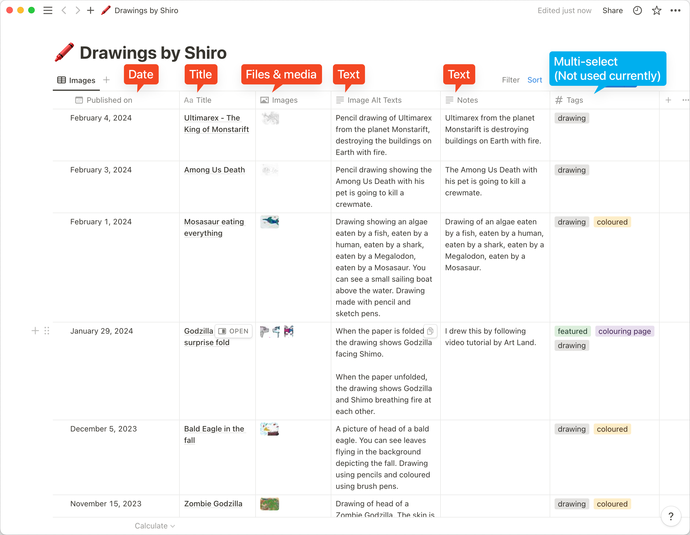

# Source code for shiro.ws

The project is using [Eleventy](https://www.11ty.dev) and [WebC](https://www.11ty.dev/docs/languages/webc/).
We use Notion (database) as the CMS.
The website is hosted on Netlify.
We call Netlify's build hook from iOS or macOS shortcut app to rebuild and depoly the website.

||
|:--|
|Screenshot of Notion database. The fields used in generating the website are: Published On (Date), Title (Title), Images (Files & media), Image Alt Texts (Text) and Notes (Text).|


Each line of text (separated by a new line) from "Image Alt Texts" are used as `alt` text for each images.

## Development

### Create a `.env` file

Create a `.env` in the project root and populate these contents.

```env
NOTION_API_KEY=<notion-api-secret>
NOTION_PAGE_ID=<notion-database-id>
```

### Running development server

```sh
pnpm install # Installs dependencies. Only required once

pnpm run dev # Runs the development server
```
